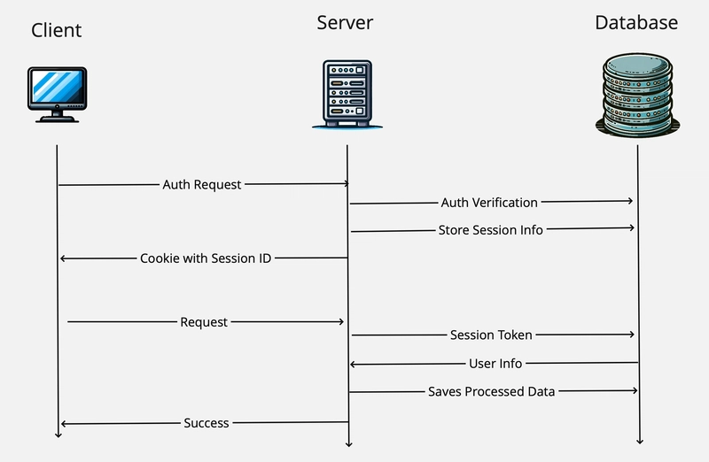

# Cookie and Session

HTTP is stateless, meaning:

- Each request is independent
- The server does not remember previous requests

=> Cookies and Sessions solve this problem

## Cookie

Cookie is:

- A small piece of data, to store basic information of user.
- Sent by the server
- Stored in the browser (client)
- Automatically sent back with future requests (same domain)

### Basic Example Flow

- **Client → Server (Login)**
  You send a POST request containing your username and password.

- **Server → Client (Set-Cookie)**
  The server verifies the credentials against the database.
  If they are valid, the server `creates a session` and sends an identification token (usually a `sessionId`) back via the Set-Cookie response header.

- **Client (Storage)**
  The browser automatically receives this header and stores the cookie locally (you do not need to write extra code for this).

- **Client → Server (Subsequent Requests)**
  For all future requests (for example, accessing the shopping cart), the browser automatically attaches the header

### What cookies usually store

- sessionId
- access token / refresh token
- user preferences (language, theme)

### Never store:

- passwords
- sensitive data in plain text

### Important cookie attributes

| Attribute         | Purpose                                      |
| ----------------- | -------------------------------------------- |
| Max-Age / Expires | How long the cookie lives                    |
| `HttpOnly`        | JS cannot read it (avoid XSS attack)         |
| `Secure`          | Only sent over HTTPS (avoid MITM)            |
| `SameSite`        | CSRF protection (or use CSRF token, or CORS) |
| Domain / Path     | Scope of the cookie                          |

---

## Session

**A session is:**

- Data stored on the server
- Associated with a specific user
- Identified by a sessionId
- Most common, sessions are stored in Redis

```txt
1. User logs in
2. Server creates session:
   sessionId = abc123
   data = { userId: 123 }

3. Server sends:
   Set-Cookie: sessionId=abc123

4. Client sends:
   Cookie: sessionId=abc123

5. Server looks up sessionId → session data

---
Cookie = ID card
Session = real user data
```

### Comparison:

| Aspect    | Cookie       | Session    |
| --------- | ------------ | ---------- |
| Stored on | Client       | Server     |
| Size      | Small (~4KB) | Large      |
| Security  | Lower        | Higher     |
| Auto-sent | Yes          | Via cookie |
| Stateful  | No           | Yes        |

---

## Session Authentication (Stateful)



### Session-based Authentication Flow

1. **Accessing a protected resource**
   The client sends a request to a protected resource on the server.
   If the client is not authenticated, the server responds with a request to log in.

2. **Sending credentials**
   The client sends their username and password to the server.

3. **Credential verification**
   The server verifies the provided credentials against the user database.

4. **Session creation**
   If the credentials are valid:

   - The server generates a unique Session ID
   - The server creates a corresponding session object in server-side storage (e.g., RAM, Redis, database, or file system)

5. **Sending the Session ID**
   The server sends the Session ID back to the client in a cookie, typically via the Set-Cookie response header.

6. **Cookie storage**
   The client (browser) automatically stores the cookie.

7. **Subsequent requests**
   For all subsequent requests, the client automatically includes the cookie containing the Session ID.

8. **Session validation**
   The server extracts the Session ID from the cookie and checks it against the stored session data to authenticate the user.

9. **Authorization**
   If the session is valid, the server grants access to the requested resource.

10. **Session invalidation**
    When the user logs out or when the session expires after a predefined timeout, the server invalidates or removes the session.

---

[← Back to Authentication](README.md) | [← Back to Main Index](../README.md)
